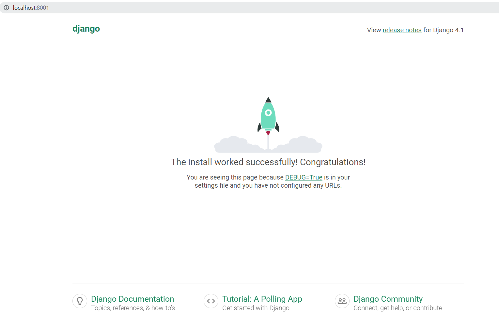

# Curso-Programacion-Orientado-Objetos-UNEMI
curso de Programación orientado a Objetos con Python

## Plantilla Inicial Docker, python 3.10 y Django 4.

1. Copiar el contenido del archivo `.env.example` en un nuevo archivo `.env`

2. Ejecutar los siguientes pasos:

        docker-compose build --no-cache
        docker-compose run --rm django django-admin startproject core .

3. Habilite las siguientes lineas en archivo `django-backend/Dockerfile` linea [30,31]:

        RUN ["chmod", "+x", "/app/docker/entrypoint.sh"]
        ENTRYPOINT ["/app/docker/entrypoint.sh"]

4. Vuelva a crear la Imagen Docker

        docker-compose build
        docker-compose up

5. Abre el navegador e ingresa:

        http://localhost:8001/

### Levantando el Servidor Django:

## En caso de no utilizar Docker, podéis utilizar entorno virtual venv (SOLO LA PRIMERA VEZ)

        1. python -m venv venv
        2. source venv/Scripts/activate
        3. python -m pip install --upgrade pip
        4. pip install -r venv-requirements.txt

        Resumido: Make install-virtual

### Creamos el proyecto Django
        Si no existe la carpeta del proyecto ejercutar los siguiente:

        1. source venv/Scripts/activate
        2. mkdir django-backend
        3. django-admin startproject core django-backend/.

        Resumido: Make init-project

## Levantar servicio Django dentro de entorno virtual venv
        1. cd django-backend/
        2. set -a; source ../.env; set +a
        3. python manage.py runserver 0.0.0.0:8001

        Abrir navegador: http://localhost:8001/

### Levantar servicio Django dentro de entorno virtual venv, con comando Make
        Make runserver
